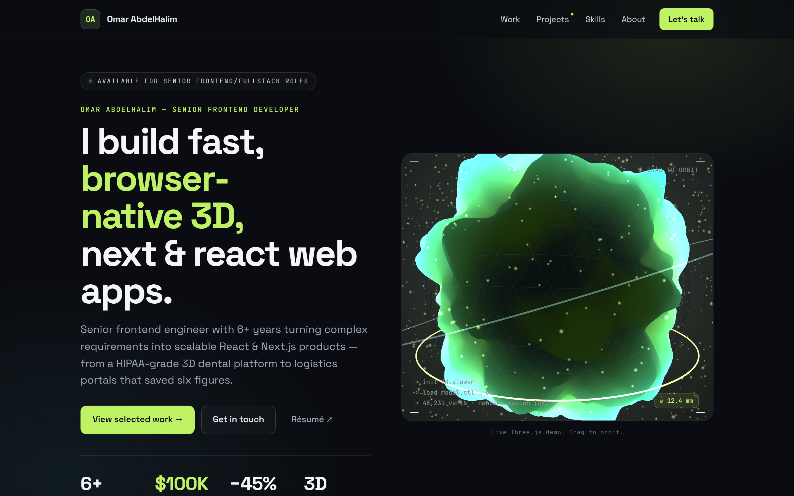
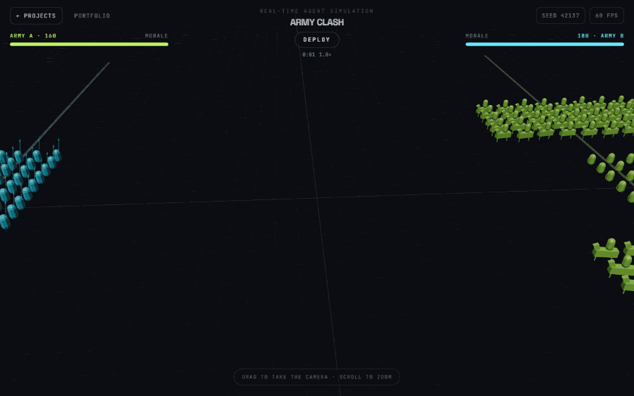
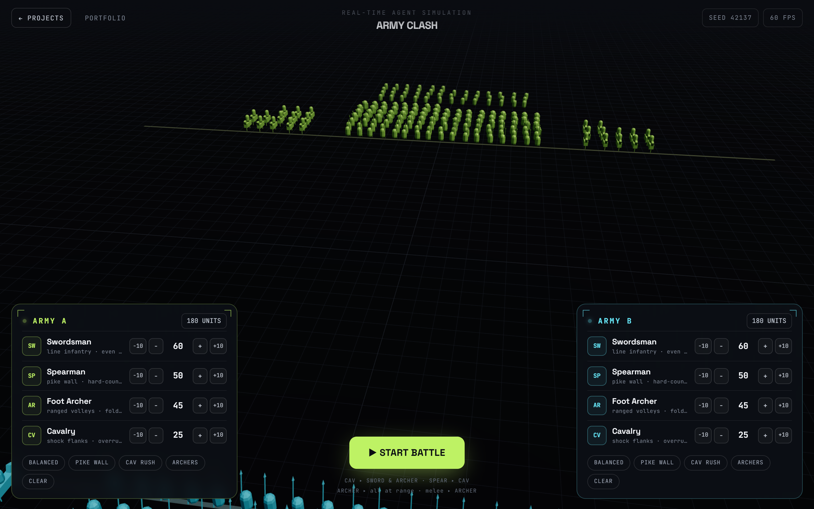

<div align="center">

# Omar AbdelHalim

**Senior Frontend Developer** &nbsp;·&nbsp; interactive & 3D web

**6+ years** turning complex requirements into fast React &amp; Next.js products —
a HIPAA-grade 3D dental platform and logistics portals that saved six figures.
Plus a personal one, built in the open: **[Army Clash](#army-clash)** — a real-time
battle simulation that holds 60fps in a browser tab.

[**▶&nbsp; Live site**](https://portfolio.omar-js-script.com) &nbsp;·&nbsp; [**Résumé (PDF)**](https://portfolio.omar-js-script.com/cv.pdf) &nbsp;·&nbsp; [**LinkedIn**](https://www.linkedin.com/in/omar-abdel-halim-452b821a5/) &nbsp;·&nbsp; [**Email**](mailto:omar.essam.se@gmail.com)


<sub>[Highlights](#highlights) &nbsp;·&nbsp; [Army Clash](#army-clash) &nbsp;·&nbsp; [Under the hood](#under-the-hood) &nbsp;·&nbsp; [Run it locally](#run-it-locally)</sub>

</div>

[](https://portfolio.omar-js-script.com)

> This repo builds the site above. It's a Next.js one-pager **plus** a `/projects`
> area for interactive pieces — the first of which, **Army Clash**, is a real-time
> agent-based battle simulation. If you're here to skim, the highlights are next;
> if you're here to read code, jump to [Under the hood](#under-the-hood).

---

## Highlights

I'm a mechanical engineer who taught himself to code and never looked back. That
instinct for breaking big systems into clean, tolerant parts is how I approach
frontend today — and why the interesting work usually ends up in the browser's
graphics stack.

|  |  |
|---|---|
| **6+ yrs** | shipping production React / Next.js apps |
| **$100K/yr** | licensing eliminated — a legacy NetSuite system rebuilt as a custom React portal |
| **3D, in-browser** | HIPAA-grade patient-scan viewer — view, manipulate &amp; edit (Three.js · WebGL) |
| **5.0s → 2.8s** | logistics dashboards made snappier — a 45% lighter bundle, faster loads |

**Where I've done it**

- **Atomica AI** — *Senior Frontend, 2024–present (remote, USA).* Built the in-browser 3D module where dentists view, manipulate and edit patient scans; led the Next.js + TypeScript migration; shipped admin &amp; billing for a multi-tier HIPAA SaaS.
- **3sixty** — *2021–2024 (remote, Atlanta).* Replaced a licensed NetSuite system with a custom React portal (**$100K/yr** saved) and nearly halved logistics-dashboard load times.
- **SWISO** — *2019–2021 (Alexandria).* Shipped four products for Saudi government &amp; EdTech, including a dynamic form engine and the real-time judging UI for an international Quran competition.

<div align="center"><sub><a href="https://portfolio.omar-js-script.com">See the full story, with live links, on the site&nbsp;↗</a></sub></div>

---

## Army Clash

*The flagship project — a self-contained game that lives at [`/projects/army-clash`](https://portfolio.omar-js-script.com/projects/army-clash).*

Compose two medieval armies from four counter-based unit types, hit **start**, and
watch an agent-based battle play out under a directed cinematic camera. Every unit
seeks, closes with, and fights on its own — there's no aggregate formula deciding
the outcome. It's a sandbox for *"what beats what."*

[](https://portfolio.omar-js-script.com/projects/army-clash)

<div align="center"><sub>Cavalry rush vs. archers: deploy → charge → clash → slow-motion climax → rout. Real-time, deterministic, rendered live.</sub></div>

**Why it's worth reading the code:**

- **Headless, deterministic engine.** All the combat logic lives in [`src/lib/army-clash/`](src/lib/army-clash) as pure domain code — **zero** React, Three.js, or DOM. It's a Structure-of-Arrays sim over typed arrays with a spatial-hash grid for neighbour lookups ([`world.js`](src/lib/army-clash/world.js), [`grid.js`](src/lib/army-clash/grid.js)), so hundreds of agents update each tick without an O(n²) scan. Same seed → the same battle, every time.
- **One clean seam.** The whole engine is consumed through a single [`index.js`](src/lib/army-clash/index.js) interface; the 3D layer only ever *reads* simulation state and draws it. Swap the renderer, keep the game.
- **Fully unit-tested.** A Vitest suite (**13 passing**) pins the rules that are easy to break — morale, routing, type counters, and healed survivors carrying into the next round.
- **Cheap to render.** Each unit is a handful of primitives merged into one silhouette and drawn with instancing — every unit on the field is just **8 instanced draw calls** (arrows add a 9th). It holds **60fps at the 300-a-side cap** — there's a live FPS readout in the HUD to check it yourself. ([ADR-0003](docs/adr/0003-stylized-instanced-silhouettes.md))
- **Decisions are written down.** The rendering approach and its trade-offs are recorded as [ADRs](docs/adr/); the domain vocabulary (*Army, Unit, Morale, Rout, Cinematic…*) is defined once in [`CONTEXT.md`](CONTEXT.md).

<div align="center">

[](https://portfolio.omar-js-script.com/projects/army-clash)

<sub>Compose each army from Swordsmen, Spearmen, Foot Archers and Cavalry — a rock-paper-scissors of counters — then start the battle.</sub>

</div>

---

## Under the hood

**Stack** — Next.js 13 (Pages Router) · React 18 · JavaScript / JSX · Tailwind CSS ·
Three.js + [`@react-three/fiber`](https://github.com/pmndrs/react-three-fiber) · Vitest ·
deployed on **AWS Amplify** (SSR).

The portfolio itself is content-driven: the entire one-pager reads from
[`data.js`](src/components/portfolio/data.js) (extracted 1:1 from the design), so
copy and layout change without touching component internals. Everything under
`/projects` is a self-contained piece — Army Clash's split between a *pure engine*
and a *render/UI layer* is the pattern the whole area follows.

```
src/
├─ components/
│  ├─ portfolio/          One-page site: Hero (+ Hero3D), Work, Skills, About, Contact
│  └─ projects/
│     ├─ ProjectsHub.jsx  The /projects index
│     └─ army-clash/      Army Clash: BattleCanvas, HUD, overlays, geometries
├─ lib/army-clash/        ★ Headless deterministic engine — pure logic, Vitest-tested
├─ pages/                 Next.js file-based routes (/, /projects, /projects/army-clash)
└─ styles/
docs/adr/                 Architecture decision records
CONTEXT.md                Domain glossary (the ubiquitous language)
openspec/                 Spec-driven change proposals
```

More context: [`ARCHITECTURE.md`](ARCHITECTURE.md) · [`CONTRIBUTING.md`](CONTRIBUTING.md) · [`docs/adr/`](docs/adr/) · [`CONTEXT.md`](CONTEXT.md)

---

## Run it locally

**Prerequisites** — [Node.js](https://nodejs.org) and [pnpm](https://pnpm.io)
(enable [Corepack](https://nodejs.org/api/corepack.html) to use the version pinned
in `package.json`).

```bash
corepack enable          # picks up pnpm@10 from package.json
pnpm install
pnpm dev                 # http://localhost:3000
```

```bash
pnpm test                # run the Army Clash engine suite (Vitest)
pnpm build               # production build (SSR; deployed on AWS Amplify)
```

---

<div align="center">

**The site *is* the portfolio — this repo is how it's built.**

[Live site](https://portfolio.omar-js-script.com) &nbsp;·&nbsp; [Résumé](https://portfolio.omar-js-script.com/cv.pdf) &nbsp;·&nbsp; [LinkedIn](https://www.linkedin.com/in/omar-abdel-halim-452b821a5/) &nbsp;·&nbsp; [omar.essam.se@gmail.com](mailto:omar.essam.se@gmail.com)

<sub>© Omar AbdelHalim · open to senior frontend / fullstack roles</sub>

</div>
